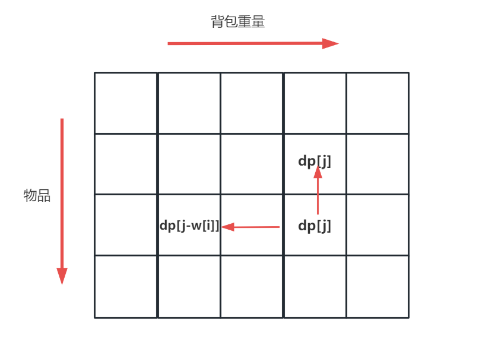

### 普通0-1背包
#### 0-1背包问题的子问题 $dp[i][j]$:
>当有$i$件物品可供选择，背包剩余重量为$j$时的最大价值
#### 0-1背包问题的DP方程式:
$$
dp[i][j]=
\begin{cases}
max\{dp[i-1][j], dp[i-1][i-w[i]]+v[i]\}& \text{w[i]<=j}\\
dp[i-1][j]& \text{w[i]>j}
\end{cases}
$$


数组压缩后：注意背包重量遍历顺序


#### 代码：
```cpp
class Solution {
public:
    bool canPartition(vector<int>& nums， int bagWeight) {
        int dp[20010] = {0}; // dp[i]代表当背包重量为i时，背包内的物品总价值
        int n = nums.size(); // 物品个数
        for(int i=1;i<=n;i++){
            for(int j=bagWeight;j>=nums[i-1];j--){
                dp[j]=max(dp[j], dp[j-nums[i-1]]+nums[i-1]);
            }
        }
        return dp[bagWeight];
    }  
};
```


### 完全0-1背包
按照0-1背包的思路，先遍历物品 $0<i<n$，再遍历背包重量 $0<j<bagWeight$，再遍历 $bagWeight/w[i]$ 个物品，时间复杂度为 $O(n^3)$  
降低时间复杂度：数组降维，去掉物品维度
```
dp[j] = max(dp[j], dp[j-w[i]]+v[i])
```  

前者其实是```dp[i-1][j]```（不选物品i），后者其实是```dp[i][j-w[i]]+v[i]```（选择物品i），注意这里不是与```dp[i-1][j-w[i]]+v[i]```比较，因为是无限制的放物品，所以如果不选择当前物品不代表之前没有选择该物品，即应该找```dp[i][j-w[i]]```这个状态，即时事实上确实之前也没有选择该物品，那在更新```dp[i][j-w[i]]```时，也通过上面的状态方程，获取了```dp[i-1][j-w[i]]```
#### 代码：
```cpp
#include <bits/stdc++.h>
using namespace std;
long long t, m, dp[10000010];
int main()
{
	cin >> t >> m;
	vector<pair<int, int>> v(m + 1);
	for (int i = 1; i <= m; i++)
		cin >> v[i].first >> v[i].second;
	for (int i = 1; i <= m; i++)
		for (int j = v[i].first; j <= t; j++)
		{
			dp[j] = max(dp[j], dp[j - v[i].first] + v[i].second);
		}

	cout << dp[t] << endl;
	system("pause");
}
```
