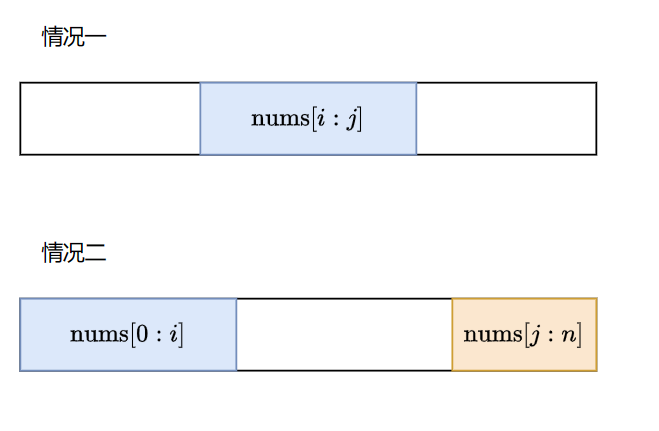

### 最大子串和的进化版

#### 方法1：

最大子串有两种情况

第一种情况就是最大子串和，第二种情况可以先固定右边部分的子串（即固定j），然后再求以0为首元素的最大连续子串和，要求尾元素在[0,j-1]之间，这样每个j都有一个固定的最大左部分子串，然后开始遍历j就可以，每个j又可以求出右部分的子串和，加上这个j对应的最大做部分子串即为每个j对应的最大子串和。

```go
func maxSubarraySumCircular(nums []int) int {
    n := len(nums)
    leftMax := make([]int, n)
    // 对坐标为 0 处的元素单独处理，避免考虑子数组为空的情况
    leftMax[0] = nums[0]
    leftSum, pre, res := nums[0], nums[0], nums[0]
    for i := 1; i < n; i++ {
        pre = max(pre + nums[i], nums[i])
        res = max(res, pre)
        leftSum += nums[i]
        leftMax[i] = max(leftMax[i - 1], leftSum)
    }        
    // 从右到左枚举后缀，固定后缀，选择最大前缀
    rightSum := 0
    for i := n - 1; i > 0; i-- {
        rightSum += nums[i]
        res = max(res, rightSum + leftMax[i - 1])
    }             
    return res
}

func max(a, b int) int {
    if a > b {
        return a
    }; 
    return b
}

func min(a, b int) int {
    if a < b {
        return a
    }; 
    return b
}
```

方法2：求反

上述的第二种情况求最大子串和可以看成是求第一种情况的最小子串和，然后与数组总和相减即可，当最小子串和为整个数组和这种情况要去掉。
```go
func maxSubarraySumCircular(nums []int) int {
    n := len(nums)
    if n==1 {
        return nums[0]
    }
    dpmax := make([]int, n)
    dpmax[0] = nums[0]
    ret := dpmax[0]
    sum := nums[0]
    // 先求最大子串和
    for i:=1;i<n;i++ {
        dpmax[i] = max(dpmax[i-1]+nums[i], nums[i])
        ret = max(dpmax[i], ret)
        sum += nums[i]
    }
    dpmin := make([]int, n)
    dpmin[0] = nums[0]
    ret = max(sum-dpmin[0],ret)
    
    // 再求最小子串和
    for i:=1;i<n;i++ {
        dpmin[i] = min(dpmin[i-1]+nums[i], nums[i])
        if sum-dpmin[i]==0 { // 表示子串为整个数组那么求反后子串就空了。
            continue
        }
        ret = max(sum-dpmin[i], ret)
    }
    return ret
}

func max(a, b int) int {
    if a > b {
        return a
    }; 
    return b
}

func min(a, b int) int {
    if a < b {
        return a
    }; 
    return b
}

```