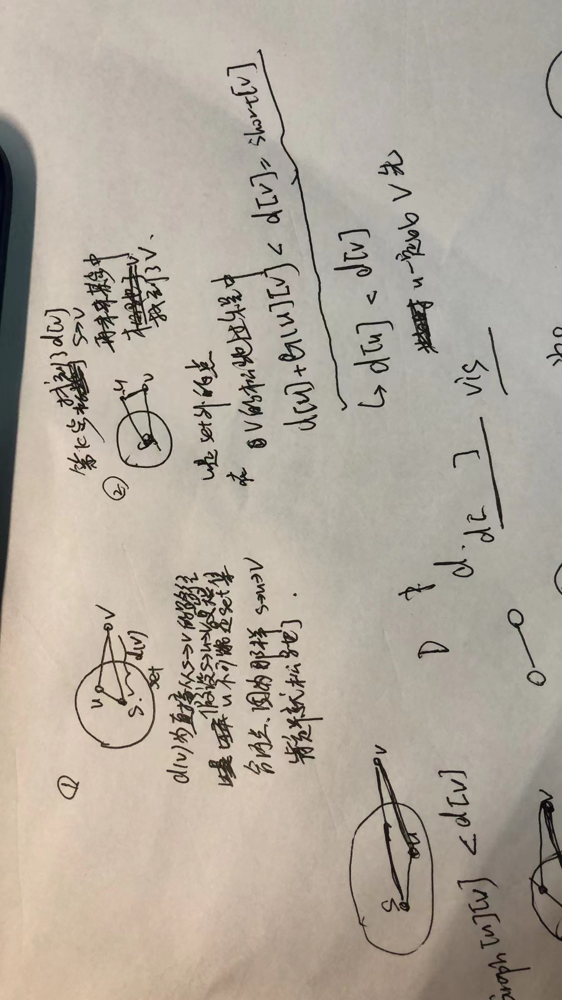

### 图：$G(v,e)$
1. 稀疏图：$v{>>}e^2$
2. 稠密图：$e{>>}v^2$
### 图的存储
1. 邻接矩阵：适用于稠密图
```
int graph[][];
```
2. 邻接表：适用于稀疏图
```
vector<int> graph[];
```
### **Dijkstra**算法：基于**Greedy**思想
1. 贪心思想：令所有点集为$V$，已确定最短路径点集为$S$，剩余点集为$V-S$，每次从$V-S$集中取到源点距离最小的点放入$S$中，直到$S$为$V$为止。

2. 贪心思想**正确性**的证明：

  首先明确要证明什么？

  **要证明**算法进行到第k步时，在$V-S$集合里，总能找到一点$u$到源点的距离为最小距离$short[u]$（这是一定的，因为集合有界），并且$short[u]$就是$u$到源点的最短距离，即后续的贪心选择不会产生更小的$short[u]$。
  **反证法证明：**

  

### **Bellman ford**算法：基于**DP**思想
参考文章：[最短路径之Bellman-Ford算法——动态规划](https://www.cnblogs.com/grandyang/p/4518091.html)
1. 可解决的问题：图中有负权边

2. 前提：
     **图中没有负权环**。因为当图中有负权环时，没遍历一次负环，对应的每个点的最短路径值就变小，并且会一直变小无法停止。
     **图中允许有正权环**。因为正权环只会使环上相应点最短路径值变大，那么在最开始遍历时得到的最短路径值就是最小的，算法会停止。也就是说最短路径中不会有正环。
     **总结**：也就是说前提要求图中没有负环，且最短路径不可能包含正环。假设图中从源点可达的点有n个（不可达自然不在讨论范围内），那么一定可以得到一个最短路径树，即该树上每个节点到根节点的路径即是该点的最短路径，并且只要图和源点确定，这棵树就唯一确定。这个设想是使用**DP求解的关键**。可以**自顶向下**求这棵树的节点值。即已知根节点，与其相邻的节点的最短路径只和根节点的最短路径值和两点间距离有关，不可能与后续的点有关。所以就可以根据根节点得出与根节点相邻的两个节点的最短路径，依次往下类推。易得某两个点的最短路径上最多有n个点，那么这棵树最高有n层，那么递推次数就是n-1次。
     算法笔记中的证明（不是很严谨）：

     

3. 动态规划的最优子结构：$dp(v,k)$表示从源点到v最多经过k条边的最短路径，那么目标就是$dp(dst,n-1)$

4. 状态转换方程：根据前面的最短路径树的构想，很容易得到
     $$
     当k=0时，d(v,0)=
     \begin{cases}
     0& \text{v=src}\\
     \infty& \text{others}
     \end{cases}\\
     当k\in(0,n-1]时，d(v,k)=min\{d(u,k−1)+cost(u,v)∣u是v的前驱顶点\}
     $$
     

5. 伪代码：

   ```c++
   initialize d(*,0)
   // 计算其余的d(*) = d(*,n-1)
   for(int k=1;k <n; k++){
   	for(每一条边(u,v))
   		d(v) = min{d(v),d(u) + cost(u,v);
   }
   ```

6. 优化：

   **方法一**：比较每轮更新前后所有点最短路径值是否改变，若有一个有变化则继续更新，否则停止更新

   **方法二**：堆优化。维持一个队列，当前节点松弛时发生值更新的节点入队。每次取队首节点进行松弛，松弛完该节点出队

### **SPFA**算法：**堆优化**后的Bellman ford算法

> SPFA就是堆优化的Bellman ford算法

### **Floyd**算法：基于**DP**思想
