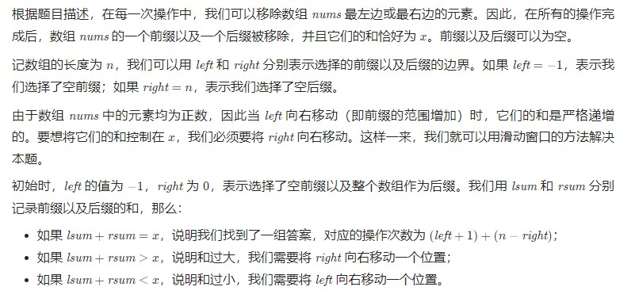

首先计算数组两侧的元素和，很容易想到转化成计算中间连续序列的和。

故先求和再减去目标值得到想要得到的连续序列和target

求连续序列和target，想到用前缀和的思想.先得到前缀和数组prefix[]

之后想要单次遍历就要得出使得序列和等于target的下标。遍历到某个下标i,将prefix[i]减去target,将这个值与之前的下标处的前缀和进行**匹配**，如果找到则找到一个符合条件的序列，然后依次遍历找到最大序列即可（连续序列越大，则两侧的元素数量越小）

至于怎么匹配，很容易想到哈希表,定义unordered_map<int, int>

用哈希表记录每个前缀和对应的下标即可。

```c++
class Solution {
public:
    int minOperations(vector<int>& nums, int x) {
        int sum = 0;
        int prefix[100010] = {0};
        unordered_map<int, int> map;  // 记录前缀和->下标的映射
        map[0] = 0;
        // 计算前缀和
        for(int i=1;i<=nums.size();i++) {
            sum+=nums[i-1];
            prefix[i] = nums[i-1]+prefix[i-1];
            map[prefix[i]] = i;
        }
        int target = sum-x;
        int ret = -1;
        // 遍历前缀和
        for(int i=0;i<=nums.size();i++){
            if(map.count(prefix[i]-target)!=0 && i-map[prefix[i]-target]>ret){
                ret = i - map[prefix[i]-target];
            }
        }
        return ret==-1?-1:nums.size()-ret;
    }
};
```

但是时间和空间复杂度都为O(n)

要减小空间复杂度，需要使用滑动窗口的方法

滑动窗口的关键在于双指针怎么去移动？
很简单的一个想法是，既然两侧的和（或中间序列的和）要和x(或target)进行比较大小，那么大了就把指针往使得和小的方向移动，小了就往和大的方向移动。

那么很自然想到两个指针，每个指针都有两个方向的移动，要怎么去决定大（小）了移哪个指针？

答案是不需要去决定，只要初始设定移哪根就哪根，最后得到的结果是一样的。

设想这样一个情况：当前两侧和大于x，那么可以向左移左指针，也可以向右移右指针，但是只可以移一个，假设移了右指针，那么有人会想会不会漏过某些情况呢（如果左移左指针会不会开辟出一条全新的时间线呢？哈哈哈哈），答案是不会的。因为左指针和右指针最初始时都是在数组的边界，既然都移动到了目前的位置，说明左指针早就已经经过了如果左移后所处的位置，并且可以想到，右指针不动，左指针左移后两个指针所处的位置情况，在之前就已经遇到过了。所以肯定是已经记录过了。



```c++
class Solution {
public:
    int minOperations(vector<int>& nums, int x) {
        int n = nums.size();
        int sum = accumulate(nums.begin(), nums.end(), 0);

        if (sum < x) {
            return -1;
        }

        int right = 0;
        int lsum = 0, rsum = sum;
        int ans = n + 1;

        for (int left = -1; left < n; ++left) {
            if (left != -1) {
                lsum += nums[left];
            }
            while (right < n && lsum + rsum > x) {
                rsum -= nums[right];
                ++right;
            }
            if (lsum + rsum == x) {
                ans = min(ans, (left + 1) + (n - right));
            }
        }

        return ans > n ? -1 : ans;
    }
};
```


